# QuickDoc — Hyperlocal Healthcare Booking App
> **Tagline:** "Know your queue position before you leave home."

---

## ⚡ Tech Stack (Latest 2026 — Fast, Free, Scalable)

| Layer | Technology | Version | Cost | Why |
|-------|-----------|---------|------|-----|
| **Mobile App** | React Native (Expo) | SDK 52+ | Free | Android + iOS single codebase |
| **UI Library** | NativeWind v4 + Tailwind CSS | v4 | Free | Fastest styling, Zomato-level UI |
| **Navigation** | Expo Router v4 | v4 | Free | File-based routing, fastest navigation |
| **Auth — OTP** | Firebase Auth + SMS Retriever API | Latest | Free | Auto-reads OTP like Zomato/Swiggy |
| **Auth — Google** | Google Sign-In (One Tap) | Latest | Free | One-tap login, no password |
| **State Management** | Zustand | v5 | Free | Lightweight, faster than Redux |
| **Database** | Firestore | Latest | Free (1GB) | Scales automatically |
| **Live Queue** | Firebase Realtime Database | Latest | Free | <100ms real-time sync |
| **File Storage** | Firebase Storage | Latest | Free (5GB) | Reports, prescriptions |
| **Notifications** | Firebase FCM v1 API | v1 | Free | Push notifications |
| **Serverless** | Firebase Cloud Functions v2 | v2 | Free (2M calls/month) | Business logic + webhooks |
| **Search** | Algolia InstantSearch | Latest | Free (10k/month) | <50ms search results |
| **Filter Speed** | Algolia Facets (pre-indexed) | Latest | Free | Zero loading on filter tap |
| **Maps** | Google Maps SDK for RN | Latest | Free (28k/month) | Location + clinic pins |
| **Directions** | Google Directions API | Latest | Free (limited) | Route to clinic |
| **Geolocation** | GeoFire v7 + Firestore geo queries | v7 | Free | Nearby doctor search |
| **Payments** | Razorpay React Native SDK | Latest | 2% per txn | UPI + Card + NetBanking |
| **Subscriptions** | Razorpay Subscriptions API | Latest | Included | Doctor monthly plans |
| **GST Invoices** | Razorpay Invoice API | Latest | Included | Auto-generated on every payment |
| **Analytics** | Firebase Analytics + Mixpanel | Latest | Free | User behaviour tracking |
| **Image Optimization** | Cloudinary (free tier) | Latest | Free (25GB) | Doctor/clinic photos fast load |
| **Language / i18n** | react-i18next | v15 | Free | One-click full app language switch |
| **Forms** | React Hook Form + Zod | Latest | Free | Fast form validation |
| **Offline Support** | Firestore offline persistence | Built-in | Free | Works with poor internet |
| **Backend (Scale later)** | Node.js 22 + Cloud Run | Latest | Pay per use | Migrate from Firebase when needed |
| **CDN (Scale later)** | Cloudflare | Latest | Free tier | Global fast delivery |

> **MVP total cost: ₹0–₹500/month** (Firebase free tier + Razorpay 2% only on actual transactions)

---

## 🚀 Fast Auth Flow — Like Zomato / Swiggy

### Why Zomato Login Feels Instant
- Phone number → OTP sent → **OTP auto-read by app** (no manual typing) → logged in
- Google → **One tap** → logged in
- Zero friction. Under 10 seconds total.

### QuickDoc Auth Flow

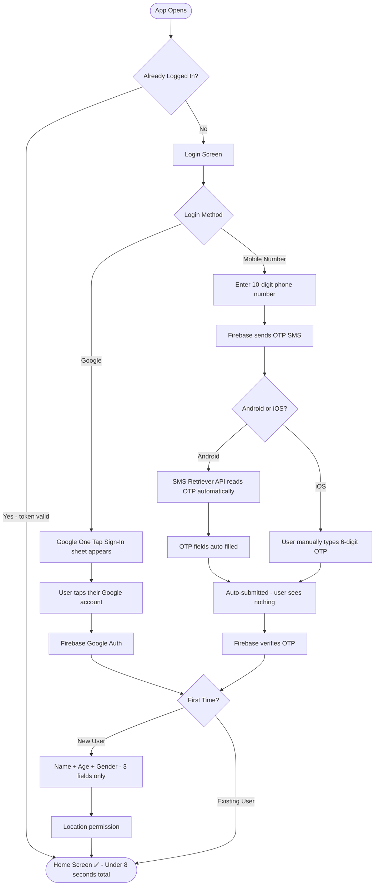

### Speed Rules for Auth
```
❌ No email/password login (slow, users forget passwords)
❌ No 10-step registration form
❌ No email verification step
✅ Phone OTP — primary (most Indians trust this)
✅ Google — secondary (urban users prefer)
✅ Auto-read OTP on Android (SMS Retriever API — free, no extra library)
✅ Only 3 fields after first login: Name + Age + Gender
✅ Profile completion optional — user can skip and fill later
```

---

## ⚡ Fast Filter Architecture (Zero Loading on Tap)

### Why Filters Feel Slow in Most Apps
Most apps call the server every time a filter is tapped → 500ms–2s wait → bad experience.

### QuickDoc Filter Strategy — Instant Results

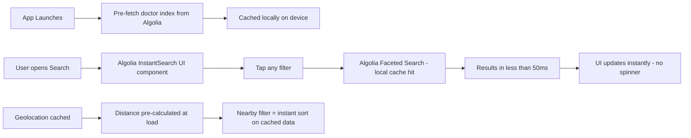

### How It Works
| Action | Speed | How |
|--------|-------|-----|
| Type in search bar | < 50ms | Algolia InstantSearch debounced at 150ms |
| Tap "Female Doctor" filter | Instant | Algolia facet — pre-indexed |
| Tap "Nearby 2km" | Instant | GeoFire result cached at app open |
| Tap "Available Now" | < 100ms | Firebase Realtime DB flag pre-subscribed |
| Tap specialty icon | Instant | Algolia facet filter — no server call |
| Scroll through results | 60fps | Virtualised FlatList with lazy image loading |

---

## 💳 GST Invoice — What It Is (Simple Explanation)

### What is GST Invoice?
```
Every time a user pays Rs 10–20 booking fee:
→ Government requires you to give them a tax receipt
→ This receipt is called a GST Invoice
→ It shows: Your business name, GSTIN, amount, 18% GST breakdown

Example:
Platform fee:    Rs 10.00
GST (18%):       Rs  1.80
Total paid:      Rs 11.80  ← what user actually pays

The Rs 1.80 GST goes to the government.
You keep Rs 10.00.
```

### When Do You Need GST?
```
Annual revenue < Rs 20 Lakh → GST registration NOT mandatory
Annual revenue > Rs 20 Lakh → GST registration MANDATORY

For MVP phase (0–6 months) → You likely won't hit Rs 20L
→ Start without GST registration
→ Register when revenue grows

BUT: Razorpay will auto-generate receipts even without GST
→ Add GSTIN later when you register
```

### Auto Invoice via Razorpay
```
You don't write invoices manually.
Razorpay generates them automatically for every payment.
User gets invoice on their email/WhatsApp.
You get transaction report in Razorpay dashboard.
```

---

## 🔄 Cancellation + Refund Flow (Rs 10–20 Booking Fee)

### Simple Policy
```
Rs 10–20 is a small amount.
Best strategy: Make refund EASY and INSTANT.
→ Users trust apps that refund without drama.
→ This is also a trust differentiator over Practo.
```

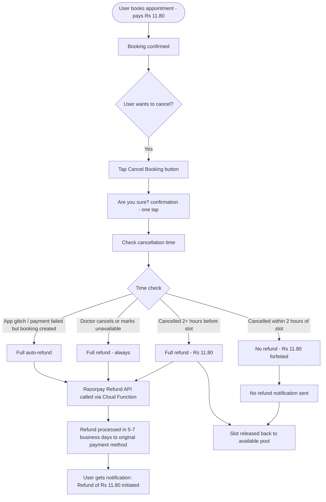

### Why "2 hours before slot" Rule?
```
If slot is at 11:00 AM:
→ Cancel before 9:00 AM → Full refund ✅
→ Cancel at 10:30 AM (30 min before) → No refund ❌

Why? Doctor blocked that slot for you.
After 2 hours, the slot cannot be filled by someone else.
Rs 10-20 is fair to lose in that case.
```

### Doctor Cancels → Always Full Refund
```
Doctor marks "Unavailable Today" in panel
→ All bookings for that day auto-cancelled
→ All patients auto-refunded Rs 11.80
→ Notification: "Dr. Sharma cancelled today. Full refund initiated."
→ App suggests next available slot
```

---

## 🏗️ Razorpay Setup — Your Dashboard (3 Steps to Complete)

> You already have Razorpay account. Dashboard shows 0/3 completed. Here's what to do:

### Step 1 — Add Website/App Details
```
In Razorpay Dashboard → "Add Website link"
→ If you don't have app live yet, add a placeholder:
   Website: https://quickdoc.in (buy this domain or any placeholder)
→ App name: QuickDoc
→ Business category: Healthcare / Medical Services
→ Click "I'll add this later" for now and proceed to Step 2
```

### Step 2 — Set Up Payment Gateway
```
→ Get your API Keys from: Settings → API Keys
→ Two keys:
   Key ID:     rzp_test_XXXXXXXXXX   (for testing)
   Key Secret: XXXXXXXXXXXXXXXXXX    (keep secret, never in app code)
→ In your app, use Key ID only
→ Key Secret stays in Firebase Cloud Function (server side only)
→ Switch to rzp_live_XXX when going live
```

### Step 3 — Accept First Payment (Test Mode)
```
→ Turn on Test Mode (bottom left of Razorpay sidebar)
→ Use test card: 4111 1111 1111 1111 | Expiry: any future | CVV: any
→ Test UPI: success@razorpay
→ Verify webhook in: Settings → Webhooks
→ Add webhook URL: your Firebase Function URL
```

### Razorpay in React Native App
```javascript
// Install
npx expo install react-native-razorpay

// Usage (booking fee payment)
const options = {
  description: 'Doctor Appointment Booking',
  currency: 'INR',
  key: 'rzp_test_YOUR_KEY_ID',      // from Razorpay dashboard
  amount: 1180,                      // Rs 11.80 in paise (×100)
  name: 'QuickDoc',
  prefill: {
    contact: userPhone,
    name: userName,
  },
  theme: { color: '#0EA5E9' }        // your app color
}

RazorpayCheckout.open(options)
  .then(data => verifyPaymentOnServer(data))  // always verify on server
  .catch(error => handlePaymentFailed(error))
```

> ⚠️ **Critical Security Rule:** NEVER verify payment on the app side. Always verify `razorpay_signature` in your Firebase Cloud Function. App-side verification can be faked.

---

## 📱 Complete Updated Architecture (2026 Latest)

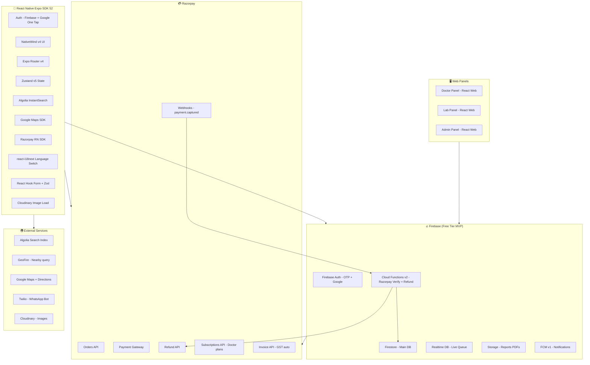

---

## 🔥 Competitive Feature Analysis

### What Zocdoc Does That Users Love (and Indian Apps Don't Have)

| Zocdoc Feature | Practo | QuickDoc Plan |
|---------------|--------|---------------|
| Real-time slot availability (book instantly, no "request") | ❌ Partial | ✅ Yes |
| Only verified patients can leave reviews | ❌ Anyone reviews | ✅ Yes |
| Pre-visit patient intake form (online before visit) | ❌ No | ✅ Yes |
| Insurance / payment mode shown before booking | ❌ No | ✅ Yes (UPI/Cash/Card filter) |
| Automatic reminders at multiple intervals | ❌ Basic | ✅ Smart reminders |
| New patient vs returning patient slot types | ❌ No | ✅ Yes |
| Doctor's languages spoken on profile | ❌ No | ✅ Yes |
| Real clinic photos (not stock images) | ❌ Stock photos | ✅ Verified photos |

---

### What Indian Market Apps Are Missing (Your Opportunity)

| Gap in Indian Apps | Why It Matters | QuickDoc Solution |
|-------------------|---------------|-------------------|
| No live queue visibility | #1 pain point in India | ✅ Core USP |
| No female doctor filter | Women avoid clinics without this | ✅ Add filter |
| No language filter | India has 22 languages | ✅ Hindi/regional filter |
| No real wait time history | "This doctor is always 45 min late" | ✅ Track avg delay |
| No family profiles | Indians book for parents/children | ✅ Family accounts |
| No follow-up reminders | "Come back in 2 weeks" forgotten | ✅ Doctor sets reminder |
| No symptom → doctor mapping | Users don't know which doctor to visit | ✅ Symptom checker |
| No emergency nearby | "Open right now" urgent search | ✅ Emergency mode |
| No prescription digitization | Paper prescriptions get lost | ✅ Scan + store |
| No ABHA integration | Govt health ID ignored by apps | ✅ Phase 2 |
| App only in English | Tier 2/3 users struggle | ✅ Hindi UI |
| No parking/accessibility info | Matters for elderly patients | ✅ Clinic details |
| No medicine reminders post-visit | Patients forget dosage | ✅ Med reminder |
| No second opinion feature | No way to cross-check diagnosis | ✅ Phase 3 |
| No "doctor running late" alert | Patient leaves home unnecessarily | ✅ Live delay alert |

---

## 🚀 Enhanced Features (QuickDoc Exclusive)

### Feature 1: Verified Reviews Only
```
Only patients who BOOKED via QuickDoc can leave a review.
Star rating + written review + date of visit shown.
→ Builds real trust. Practo has fake review problem.
```

### Feature 2: Family Profiles
```
One account → Add family members (spouse, parents, children)
Book for any family member in 2 taps.
Health records, prescriptions stored per member.
→ Indians manage healthcare for entire family.
```

### Feature 3: Symptom Checker → Doctor Suggestion
```
User selects symptoms (fever, headache, chest pain etc.)
App suggests: "See a General Physician" or "See ENT"
Directly shows matching nearby doctors.
→ Reduces wrong doctor bookings.
```

### Feature 4: Doctor Running Late Alert
```
Doctor marks "running 20 min late" in panel.
All waiting patients get instant notification.
"Dr. Sharma is running 20 min late. No need to rush."
→ Saves patient's time. No other Indian app does this.
```

### Feature 5: Emergency / Open Now Mode
```
One-tap "Find Open Clinic NOW"
Shows only doctors available RIGHT NOW (walk-in)
Sorted by nearest distance
→ For fever at 9pm, weekend emergencies etc.
```

### Feature 6: Pre-Visit Health Form
```
After booking → app shows short form:
- Main complaint
- Duration of symptoms
- Current medications
- Allergies
Doctor sees this before the patient arrives.
→ Saves time in consultation. Doctor is prepared.
```

### Feature 7: Smart Follow-Up Reminders
```
Doctor clicks "Follow-up in X days" in panel.
Patient gets reminder notification automatically.
"Your follow-up with Dr. Sharma is due tomorrow."
→ Better health outcomes + keeps users in app.
```

### Feature 8: Medicine Reminders
```
After visit, user adds medicines from prescription.
Sets dosage timing (morning/afternoon/night).
App sends daily medicine reminder notifications.
→ High daily active usage. Users open app every day.
```

### Feature 9: Health Timeline
```
All in one place:
- Past appointments with dates
- Lab reports (PDF)
- Prescriptions
- Medicines taken
- Doctor notes
→ Complete health history. Users will never delete this app.
```

### Feature 10: WhatsApp Booking (No App Needed)
```
Doctor shares a WhatsApp link.
Patient books slot via WhatsApp chat bot.
No app install needed.
→ Reaches non-smartphone-savvy patients. 
→ Viral distribution via WhatsApp forwards.
```

### Feature 11: Real Clinic Photos + Virtual Tour
```
Clinic uploads real photos (reception, rooms, cleanliness).
No stock images allowed.
→ Patients trust clinic before visiting. Reduces anxiety.
→ Verified badge: "Photos verified by QuickDoc team"
```

### Feature 12: Doctor Availability Alerts
```
User checks doctor → Doctor is fully booked today.
User taps "Notify me when slot opens"
→ Gets push notification when cancellation happens.
→ Fills doctor's cancelled slots automatically.
```

### Feature 13: Average Wait Time History
```
App tracks actual vs scheduled times over past 30 days.
Shows on doctor profile:
"This doctor typically runs 15 min late"
"Usually on time ✅"
→ Honest information. Users trust app more.
```

### Feature 14: Payment Mode Filter
```
Filter doctors by: Cash only / UPI / Card accepted
Shows on doctor profile clearly.
→ Avoids surprise at clinic counter.
→ Very useful in Tier 2/3 cities where card not common.
```

### Feature 15: Language Filter
```
Filter: Hindi / English / Tamil / Telugu / Marathi / Bengali etc.
Doctor profile shows languages spoken.
→ Massive advantage in India's multilingual market.
→ Elderly patients can find doctor who speaks their language.
```

### Feature 16: ABHA Integration (Phase 2)
```
ABHA = Ayushman Bharat Health Account (Govt of India)
Users link their ABHA ID to QuickDoc.
Health records sync with national health registry.
→ Gives government-level trust to your app.
→ Differentiator no small app has done yet.
```

---

## Updated Priority Build Order

| Priority | Feature | Phase |
|----------|---------|-------|
| 🔴 Must have Day 1 | Live queue + Doctor booking + Maps | Phase 1 |
| 🔴 Must have Day 1 | Verified reviews only | Phase 1 |
| 🔴 Must have Day 1 | Female doctor + Language filter | Phase 1 |
| 🟡 High value | Family profiles | Phase 1 |
| 🟡 High value | Doctor running late alert | Phase 1 |
| 🟡 High value | Emergency / Open Now mode | Phase 1 |
| 🟡 High value | Lab test booking | Phase 2 |
| 🟡 High value | Pre-visit health form | Phase 2 |
| 🟡 High value | Medicine reminders | Phase 2 |
| 🟡 High value | Health timeline | Phase 2 |
| 🟡 High value | Doctor availability alerts | Phase 2 |
| 🟡 High value | Average wait time history | Phase 2 |
| 🟡 High value | Payment mode filter | Phase 2 |
| 🟢 Nice to have | WhatsApp booking | Phase 3 |
| 🟢 Nice to have | Symptom checker | Phase 3 |
| 🟢 Nice to have | ABHA integration | Phase 3 |
| 🟢 Nice to have | Second opinion | Phase 3 |
| 🟢 Nice to have | Hindi UI | Phase 3 |

---

## 1. Overall System Architecture

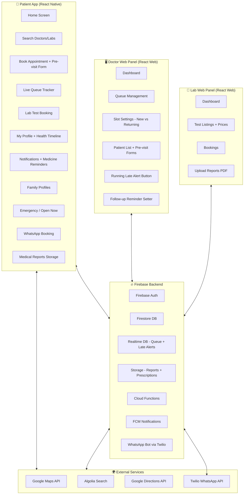

---

## 2. User Onboarding Flow

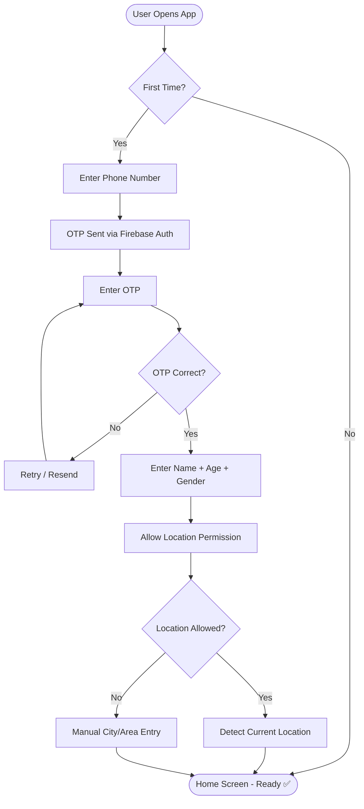

---

## 3. Doctor Search + Filter Flow

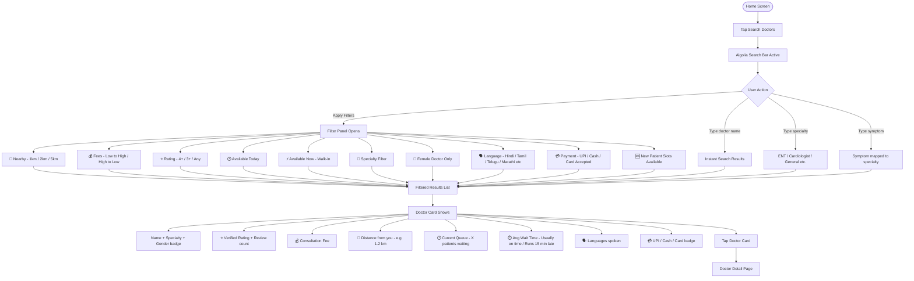

---

## 4. Doctor Detail + Location View Flow

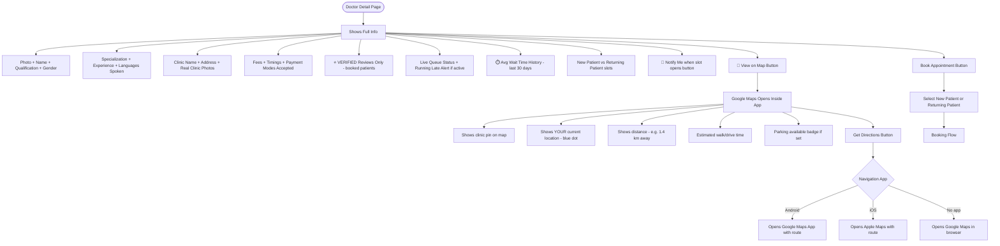

---

## 5. Appointment Booking Flow

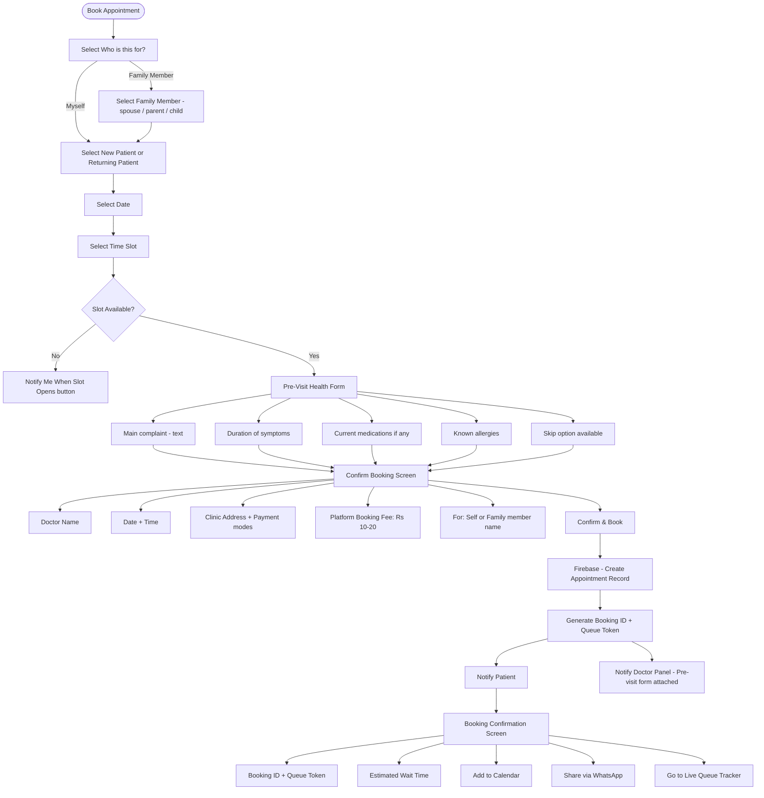

---

## 6. Live Queue System Flow (Core USP)

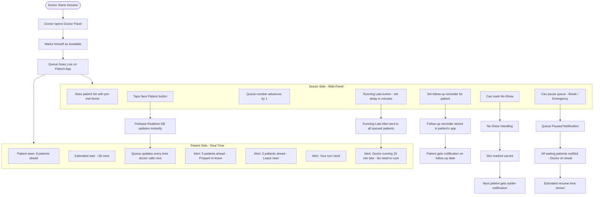

---

## 7. Lab Test Booking Flow

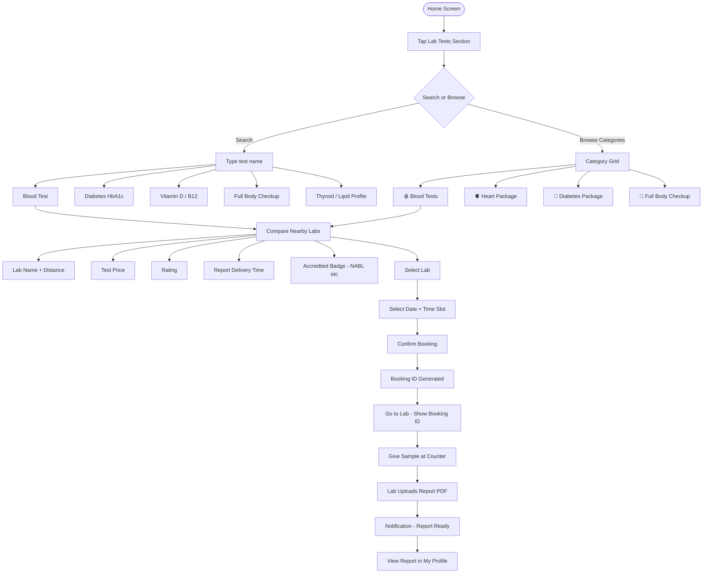

---

## 8. Real-Time Location Scenarios

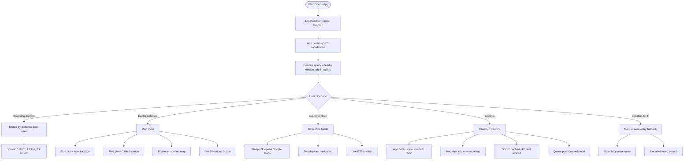

---

## 9. Notification System Flow

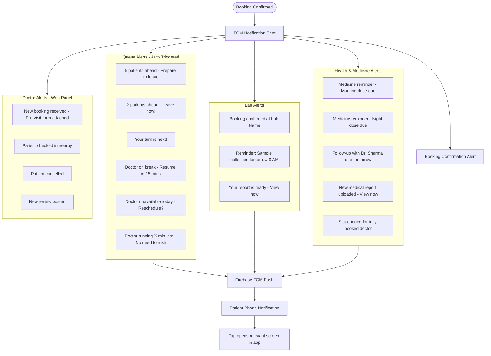

---

## 10. Doctor Panel Flow (Web Dashboard)

```mermaid
flowchart TD
    A([Doctor Opens Web Panel]) --> B[Login with Phone OTP]
    B --> C[Dashboard Home]

    C --> D[Today's Overview]
    D --> D1[Total booked today]
    D --> D2[Patients seen]
    D --> D3[Patients remaining]
    D --> D4[No-shows]
    D --> D5[New patients vs Returning patients count]

    C --> E[Queue Management]
    E --> E1[Start Queue Button]
    E --> E2[Next Patient - see pre-visit form inline]
    E --> E3[Mark No-Show]
    E --> E4[Pause Queue - set resume time]
    E --> E5[Running Late Button - set delay minutes]
    E --> E6[End Session]

    C --> F[Slot Settings]
    F --> F1[Set available days]
    F --> F2[Set timings]
    F --> F3[Max patients per slot]
    F --> F4[Block dates - Holiday / Emergency]
    F --> F5[New patient slot ratio vs Returning]

    C --> G[Patient List]
    G --> G1[Name + Token + New or Returning badge]
    G --> G2[Pre-visit form responses visible]
    G --> G3[Set Follow-up Reminder per patient]

    C --> H[Reviews Section]
    H --> H1[All verified reviews visible]
    H --> H2[Average rating breakdown]

    C --> I[Profile Settings]
    I --> I1[Fees update]
    I --> I2[Specialization + Languages Spoken]
    I --> I3[Clinic address + Parking availability]
    I --> I4[Payment modes accepted - UPI / Cash / Card]
    I --> I5[Real clinic photos upload]
    I --> I6[Gender setting]
```

---

## 11. Lab Partner Panel Flow

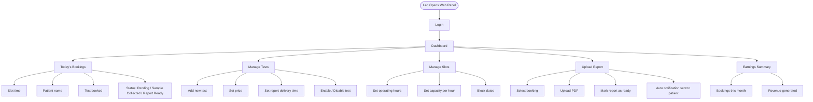

---

## 12. Verified Reviews Flow

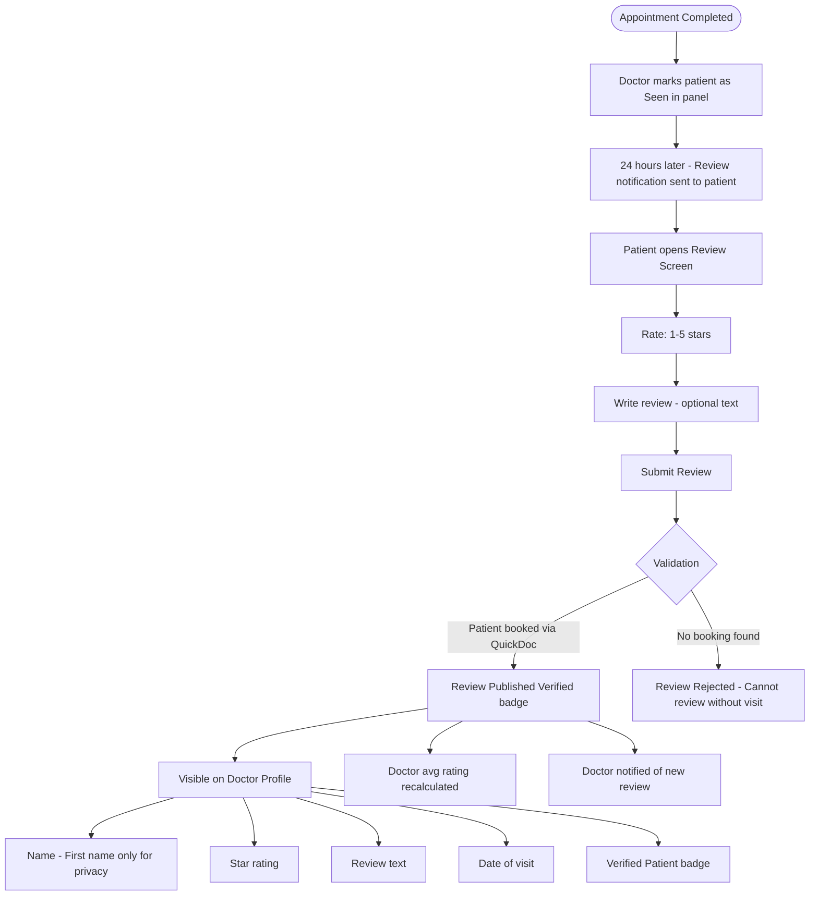

---

## 13. Medicine Reminders Flow

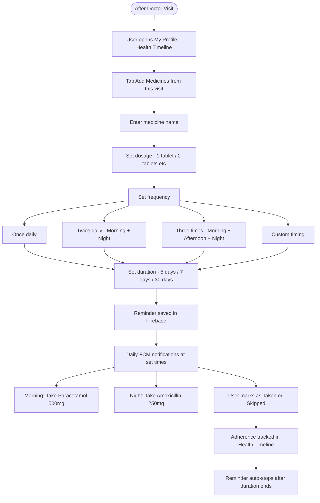

---

## 14. Health Timeline Flow

```mermaid
flowchart TD
    A([My Profile - Health Timeline]) --> B[Chronological list of all health events]

    B --> C[Appointments Section]
    C --> C1[Date + Doctor name + Specialty]
    C --> C2[Pre-visit form responses]
    C --> C3[Doctor notes if added]
    C --> C4[Prescription PDF if uploaded]
    C --> C5[Follow-up date if set]

    B --> D[Lab Reports Section]
    D --> D1[Test name + Lab name + Date]
    D --> D2[View PDF report button]
    D --> D3[Download report button]
    D --> D4[Share report button - WhatsApp / Email]

    B --> E[Medical Reports Section]
    E --> E1[User manually uploads reports]
    E --> E2[Old reports - X-ray / MRI / Blood reports]
    E --> E3[Name the report + date]
    E --> E4[Stored in Firebase Storage]
    E --> E5[Share with doctor button]

    B --> F[Medicines Section]
    F --> F1[Current medicines with reminders]
    F --> F2[Past medicine history]

    B --> G[Family Members Tab]
    G --> G1[Switch between family member timelines]
    G --> G2[Each member has own complete timeline]
```

---

## 15. Medical Report Upload Flow

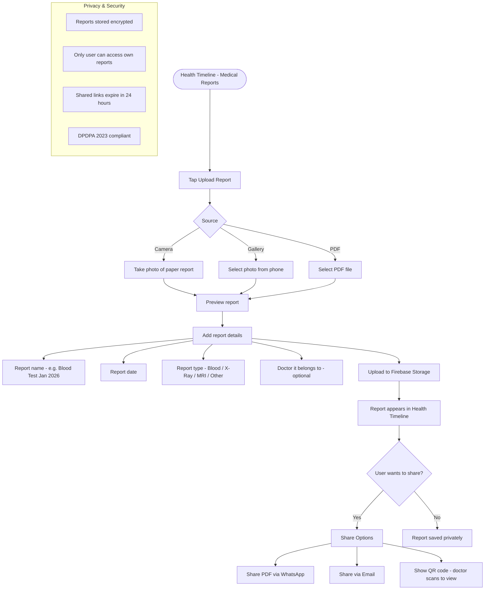

---

## 16. WhatsApp Booking Flow

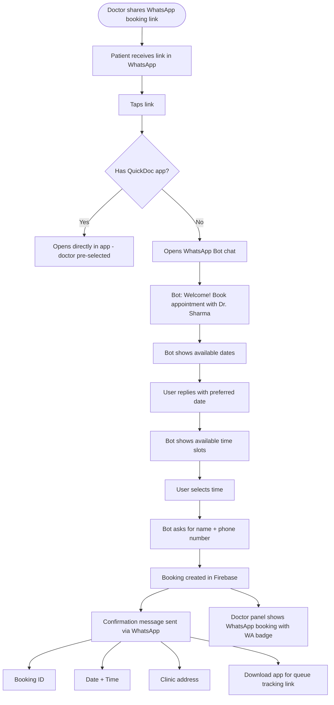

---

## 17. Emergency / Open Now Mode Flow

```mermaid
flowchart TD
    A([Home Screen]) --> B[Tap Emergency / Open Now button]
    B --> C[GPS location detected instantly]
    C --> D[Query: Doctors available RIGHT NOW within 5km]
    D --> E{Results Found?}
    E -->|Yes| F[List sorted by nearest first]
    F --> F1[Doctor name + Specialty]
    F --> F2[Distance - 0.3km away]
    F --> F3[Queue: 2 patients - walk in now]
    F --> F4[Clinic closes at: 10:00 PM]
    F --> G[Tap to see on map]
    G --> H[Get Directions immediately]
    E -->|No results nearby| I[Expand radius to 10km]
    I --> J{Results?}
    J -->|Yes| F
    J -->|No| K[Show nearest hospitals + emergency numbers]
    K --> K1[Ambulance: 108]
    K --> K2[Nearest hospital with directions]

    subgraph WalkInLogic["Walk-in Logic"]
        W1[Doctor marks Accept Walk-ins: ON in panel]
        W2[Shown in Emergency mode only when queue less than 5]
        W3[Auto-hidden when doctor marks session ended]
    end
```

---

## 18. Average Wait Time History Flow

```mermaid
flowchart TD
    A([Every Appointment Completed]) --> B[System records actual wait time]
    B --> B1[Scheduled time: 10:30 AM]
    B --> B2[Patient actually called: 10:52 AM]
    B --> B3[Wait time recorded: 22 minutes]

    B3 --> C[Firebase Cloud Function calculates rolling average]
    C --> D[Last 30 days average computed]
    D --> E[Doctor profile updated with wait time badge]

    E --> F{Average Wait Time}
    F -->|Less than 5 min| G[Usually on time badge - green]
    F -->|5 to 15 min| H[Slight wait expected - yellow]
    F -->|More than 15 min| I[Typically runs X min late - orange]

    G & H & I --> J[Shown on Doctor Card in search results]
    J --> K[Shown on Doctor Detail page]
    K --> L[User makes informed decision before booking]
```

---

## 19. Complete User Journey (End to End)

```mermaid
journey
    title Patient Full Healthcare Journey in QuickDoc
    section Discovery
      Opens app: 5: Patient
      Allows location: 4: Patient
      Sees nearby doctors: 5: Patient
    section Doctor Booking
      Searches doctor by specialty: 5: Patient
      Filters by distance + fees: 5: Patient
      Views live queue wait time: 5: Patient
      Views clinic on map: 4: Patient
      Gets directions: 4: Patient
      Books appointment: 5: Patient
    section At Clinic
      Receives queue alerts: 5: Patient
      Leaves home on time: 5: Patient
      Shows booking ID at counter: 4: Patient
      Sees doctor: 5: Patient
      Gets prescription: 5: Patient
    section Lab Tests
      Doctor suggests blood test: 5: Patient
      Searches test in app: 5: Patient
      Compares nearby labs: 5: Patient
      Books affordable lab: 5: Patient
      Visits lab next morning: 4: Patient
      Gets digital report: 5: Patient
```

---

## 13. Scalability Architecture (Future - When You Hit Traffic)

```mermaid
graph LR
    subgraph Scale["Scale Phase - After 100k Users"]
        LB[Load Balancer - Cloudflare]
        API[Node.js API - Cloud Run]
        DB[(PostgreSQL - Cloud SQL)]
        CACHE[Redis Cache]
        SEARCH[Elasticsearch]
        QUEUE[Pub/Sub Queue]
        STORAGE[Cloud Storage]
    end

    subgraph MVP["MVP Phase - Firebase (Free)"]
        F1[Firebase Auth]
        F2[Firestore]
        F3[Realtime DB]
        F4[Firebase Storage]
        F5[Cloud Functions]
    end

    App[Mobile App] --> MVP
    MVP -.->|Migrate when needed| Scale
```

---

## 21. Data Models (Firestore Collections)

```mermaid
erDiagram
    USERS {
        string userId
        string name
        string phone
        string gender
        int age
        string preferredLanguage
        object location
        array familyMembers
        array bookingHistory
        array labHistory
    }

    FAMILY_MEMBERS {
        string memberId
        string userId
        string name
        string relation
        string gender
        int age
        array bookingHistory
    }

    DOCTORS {
        string doctorId
        string name
        string gender
        string specialty
        array languagesSpoken
        string clinicName
        object clinicLocation
        bool parkingAvailable
        array clinicPhotos
        int fees
        float rating
        int totalReviews
        object timings
        bool isAvailable
        bool acceptWalkIns
        array paymentModes
        int currentQueueCount
        int avgWaitTimeMinutes
        string waitTimeBadge
        int newPatientSlotRatio
    }

    APPOINTMENTS {
        string appointmentId
        string userId
        string familyMemberId
        string doctorId
        timestamp scheduledTime
        timestamp actualCallTime
        int queueToken
        string patientType
        object preVisitForm
        string status
        int platformFee
        string bookingSource
        string followUpDate
    }

    QUEUE {
        string queueId
        string doctorId
        int currentToken
        int totalWaiting
        bool isActive
        bool isPaused
        bool isRunningLate
        int lateByMinutes
        timestamp lastUpdated
    }

    REVIEWS {
        string reviewId
        string doctorId
        string userId
        string appointmentId
        int rating
        string reviewText
        timestamp visitDate
        bool isVerified
    }

    MEDICINE_REMINDERS {
        string reminderId
        string userId
        string memberId
        string medicineName
        string dosage
        array reminderTimes
        int durationDays
        timestamp startDate
        timestamp endDate
        bool isActive
    }

    MEDICAL_REPORTS {
        string reportId
        string userId
        string memberId
        string reportName
        string reportType
        timestamp reportDate
        string fileUrl
        bool isEncrypted
    }

    LABS {
        string labId
        string name
        object location
        float rating
        bool isNABLCertified
        array availableTests
    }

    LAB_BOOKINGS {
        string bookingId
        string userId
        string memberId
        string labId
        string testName
        int price
        timestamp slot
        string status
        string reportUrl
    }

    WAIT_TIME_HISTORY {
        string recordId
        string doctorId
        string appointmentId
        int scheduledWaitMinutes
        int actualWaitMinutes
        timestamp date
    }

    USERS ||--o{ APPOINTMENTS : books
    USERS ||--o{ FAMILY_MEMBERS : has
    USERS ||--o{ MEDICINE_REMINDERS : sets
    USERS ||--o{ MEDICAL_REPORTS : uploads
    FAMILY_MEMBERS ||--o{ APPOINTMENTS : has
    DOCTORS ||--o{ APPOINTMENTS : receives
    DOCTORS ||--|| QUEUE : manages
    DOCTORS ||--o{ REVIEWS : receives
    DOCTORS ||--o{ WAIT_TIME_HISTORY : tracked
    APPOINTMENTS ||--o{ REVIEWS : generates
    USERS ||--o{ LAB_BOOKINGS : books
    LABS ||--o{ LAB_BOOKINGS : receives
```

---

## 15. Search Optimization Strategy

```mermaid
flowchart LR
    A[User types in search bar] --> B[Algolia Instant Search]
    B --> C{Search Type}

    C -->|Doctor Name| D[Search doctors index]
    C -->|Specialty| E[ENT, Cardio, General etc]
    C -->|Symptom| F[Map symptom to specialty]
    C -->|Lab Test| G[Search tests index]

    D & E & F --> H[Geo-filtered results]
    H --> H1[Within selected radius]
    H --> H2[Sorted by relevance + distance]
    H --> H3[Available doctors ranked higher]

    G --> I[Price sorted results]
    I --> I1[Cheapest nearby labs first]
    I --> I2[NABL certified badge]

    H2 & I2 --> J[Results with real-time queue data from Firebase]
    J --> K[Final sorted list shown to user]
```

---

## 🛡️ Admin Panel — Complete Flow

> You are the admin. This is your control center to manage doctors, labs, users, disputes, and revenue.

### Admin Panel Tech
```
Framework:  React.js (web, desktop browser)
Auth:       Firebase Auth — admin email + password only
Hosting:    Firebase Hosting (free)
URL:        admin.quickdoc.in
Access:     Only you. No one else.
```

### Admin Panel Flow

```mermaid
flowchart TD
    A([Admin opens admin.quickdoc.in]) --> B[Email + Password Login]
    B --> C[Admin Dashboard]

    C --> D[Doctor Management]
    D --> D1[View all pending doctor registrations]
    D --> D2[Review submitted documents - degree, license]
    D --> D3[Approve doctor - profile goes live]
    D --> D4[Reject doctor - send reason]
    D --> D5[Suspend doctor - remove from listings]
    D --> D6[View all active doctors + stats]

    C --> E[Lab Management]
    E --> E1[View pending lab registrations]
    E --> E2[Verify NABL certificate]
    E --> E3[Approve / Reject lab]
    E --> E4[View all active labs]
    E --> E5[Flag labs with complaint history]

    C --> F[User Management]
    F --> F1[Search user by phone number]
    F --> F2[View booking history]
    F --> F3[View no-show disputes]
    F --> F4[Resolve dispute - clear no-show flag]
    F --> F5[Ban user - only after manual review]

    C --> G[Bookings Overview]
    G --> G1[Total bookings today / week / month]
    G --> G2[Revenue collected]
    G --> G3[Razorpay payout status]
    G --> G4[Failed payments]
    G --> G5[Pending refunds]

    C --> H[Reviews Moderation]
    H --> H1[Flag suspicious reviews]
    H --> H2[Remove fake or abusive reviews]
    H --> H3[Doctor disputes a review - admin reviews]

    C --> I[Featured Listings]
    I --> I1[View doctors who paid for featured]
    I --> I2[Activate / deactivate featured badge]
    I --> I3[Expiry dates and renewals]

    C --> J[Complaints & Disputes]
    J --> J1[Incomplete lab report complaints]
    J --> J2[No-show disputes from patients]
    J --> J3[Doctor not available complaints]
    J --> J4[Mark resolved / escalate]

    C --> K[Analytics]
    K --> K1[Top booked doctors]
    K --> K2[Top booked lab tests]
    K --> K3[City-wise breakdown]
    K --> K4[Revenue by month]
    K --> K5[User retention stats]
    K --> K6[App ratings trend]
```

### Doctor Verification Flow (Admin Side)

```mermaid
flowchart TD
    A([Doctor submits registration form]) --> B[Status: Under Review]
    B --> C[Admin gets notification: New doctor registration]
    C --> D[Admin opens doctor profile in panel]
    D --> E[Reviews submitted documents]
    E --> E1[Medical degree certificate]
    E --> E2[MCI / State Medical Council registration]
    E --> E3[Clinic address proof]
    E --> E4[Photo ID]
    E --> F{Admin Decision}
    F -->|All valid| G[Approve]
    F -->|Missing docs| H[Request more info - doctor notified]
    F -->|Fake / Invalid| I[Reject - reason sent to doctor]
    G --> J[Doctor profile goes live on app]
    J --> K[Doctor gets Welcome notification]
    I --> L[Doctor cannot re-register with same phone for 30 days]
```

### Admin Panel Screens Summary

| Screen | Purpose |
|--------|---------|
| Dashboard | Revenue, bookings, new registrations at a glance |
| Doctors | Approve, suspend, verify, view stats |
| Labs | Approve, verify NABL, manage complaints |
| Users | Search, resolve disputes, clear no-show flags |
| Bookings | All transactions, refund status, failed payments |
| Reviews | Moderate, remove fake, handle disputes |
| Featured | Manage paid listings, activate/deactivate |
| Complaints | All user and doctor complaints in one queue |
| Analytics | Growth metrics, revenue, top performers |
| Settings | App config, booking fee amount, notification templates |

---

## Development Phases

### Phase 1 — MVP (Month 1–3)
- [ ] Patient app: Auth (OTP auto-read + Google One Tap) + Doctor search + Booking + Live queue view
- [ ] Female doctor filter + Language filter + Payment mode filter + Specialty filter
- [ ] New patient vs Returning patient slot selection
- [ ] Doctor web panel: Queue management + Running Late button + Slot settings
- [ ] Pre-visit health form (attached to booking)
- [ ] Verified reviews (only post-visit)
- [ ] Emergency / Open Now mode
- [ ] Doctor availability alerts (notify when slot opens)
- [ ] **Admin panel**: Doctor approval + Lab approval + Dispute resolution + Revenue dashboard
- [ ] Doctor verification flow (submit docs → admin approves → profile goes live)
- [ ] Razorpay payment integration + refund flow + Rs 12 all-inclusive fee
- [ ] Privacy Policy + Terms page inside app
- [ ] Firebase Crashlytics (crash reporting)
- [ ] Firebase backend setup + Google Maps integration + Push notifications
- [ ] Firestore offline persistence (poor internet support)

### Phase 2 — Growth (Month 3–6)
- [ ] Lab test booking + Lab partner panel + Report upload
- [ ] Family profiles (book for spouse, parents, children)
- [ ] Medicine reminders (daily dosage notifications)
- [ ] Health timeline (all appointments + reports in one place)
- [ ] Medical report upload + storage (user uploads old reports)
- [ ] Average wait time history tracking + badge on doctor profile
- [ ] Follow-up reminder (doctor sets, patient notified)
- [ ] Doctor running late alert to all queued patients
- [ ] Algolia advanced search + Symptom → doctor mapping
- [ ] Real clinic photos verification

### Phase 3 — Monetization (Month 6–12)
- [ ] Rs 10–Rs 20 platform booking fee activation
- [ ] Doctor subscription plans
- [ ] Featured listing for doctors/labs
- [ ] WhatsApp booking bot (Twilio integration)
- [ ] Hindi UI / regional language support
- [ ] ABHA (Ayushman Bharat Health Account) integration
- [ ] Analytics dashboard for doctors

### Phase 4 — Scale (Year 2+)
- [ ] Teleconsultation
- [ ] Medicine delivery tie-up
- [ ] Health packages
- [ ] Second opinion feature
- [ ] Multi-city expansion

---

## Folder Structure (React Native - Expo)

```
QuickDoc/
├── app/                        # Expo Router screens
│   ├── (auth)/
│   │   ├── login.tsx
│   │   └── otp.tsx
│   ├── (patient)/
│   │   ├── home.tsx
│   │   ├── search.tsx
│   │   ├── emergency.tsx           # Open Now / Emergency mode
│   │   ├── doctor/
│   │   │   ├── [id].tsx            # Doctor detail + reviews + map
│   │   │   └── review/[id].tsx     # Post-visit review screen
│   │   ├── book/
│   │   │   ├── [doctorId].tsx      # Slot selection
│   │   │   ├── family-select.tsx   # Who is this for?
│   │   │   ├── patient-type.tsx    # New vs Returning
│   │   │   └── pre-visit-form.tsx  # Symptom form before booking
│   │   ├── queue/
│   │   │   └── [appointmentId].tsx # Live queue tracker
│   │   ├── labs/
│   │   │   ├── index.tsx
│   │   │   └── [labId].tsx
│   │   ├── timeline/
│   │   │   ├── index.tsx           # Health timeline
│   │   │   └── report-upload.tsx   # Upload medical reports
│   │   ├── medicines/
│   │   │   └── reminders.tsx       # Medicine reminder manager
│   │   └── profile/
│   │       ├── index.tsx
│   │       └── family.tsx          # Family members management
│   └── _layout.tsx
├── components/
│   ├── DoctorCard.tsx              # With wait time badge, gender, language
│   ├── LabCard.tsx
│   ├── QueueTracker.tsx            # Live queue with running late banner
│   ├── MapView.tsx
│   ├── SearchBar.tsx
│   ├── FilterPanel.tsx             # All filters including gender + language
│   ├── ReviewCard.tsx              # Verified review display
│   ├── PreVisitForm.tsx
│   ├── MedicineCard.tsx
│   ├── TimelineItem.tsx
│   ├── FamilyMemberCard.tsx
│   ├── ReportCard.tsx
│   └── EmergencyBanner.tsx
├── firebase/
│   ├── config.ts
│   ├── auth.ts
│   ├── firestore.ts
│   ├── realtimeQueue.ts
│   ├── storage.ts                  # Report upload helpers
│   └── notifications.ts
├── hooks/
│   ├── useLocation.ts
│   ├── useQueue.ts
│   ├── useSearch.ts
│   ├── useMedicineReminders.ts
│   ├── useHealthTimeline.ts
│   └── useFamilyProfiles.ts
├── store/                          # Zustand state management
│   ├── authStore.ts
│   ├── bookingStore.ts
│   ├── familyStore.ts
│   └── medicineStore.ts
└── utils/
    ├── maps.ts
    ├── notifications.ts
    ├── algolia.ts
    ├── waitTimeCalculator.ts       # Avg wait time badge logic
    └── whatsappBooking.ts          # WhatsApp deep link helpers
```
│   │   ├── doctor/[id].tsx
│   │   ├── book/[doctorId].tsx
│   │   ├── queue/[appointmentId].tsx
│   │   ├── labs/index.tsx
│   │   ├── labs/[labId].tsx
│   │   └── profile.tsx
│   └── _layout.tsx
├── components/
│   ├── DoctorCard.tsx
│   ├── LabCard.tsx
│   ├── QueueTracker.tsx
│   ├── MapView.tsx
│   ├── SearchBar.tsx
│   └── FilterPanel.tsx
├── firebase/
│   ├── config.ts
│   ├── auth.ts
│   ├── firestore.ts
│   └── realtimeQueue.ts
├── hooks/
│   ├── useLocation.ts
│   ├── useQueue.ts
│   └── useSearch.ts
├── store/                          # Zustand state management
│   ├── authStore.ts
│   └── bookingStore.ts
└── utils/
    ├── maps.ts
    ├── notifications.ts
    └── algolia.ts
```

---

## Key Numbers to Track (KPIs)

| Metric | Target Month 3 | Target Month 6 |
|--------|---------------|----------------|
| Active Doctors | 20 | 100 |
| Active Labs | 5 | 25 |
| Daily Bookings | 50 | 500 |
| Monthly Revenue | ₹0 (free phase) | ₹10k–₹50k |
| App Rating | 4.0+ | 4.3+ |
| User Retention (D7) | 30% | 45% |
| Medicine Reminder DAU | - | 60% of users |
| Health Timeline Users | - | 70% of users |

---

## ⚠️ Why People Hate Practo — And How QuickDoc Avoids Every Single One

### Problem 1: Marketing-Driven Ratings (Paid Doctors Ranked Higher)

> **Practo problem:** Doctors who pay for "Prime" listings appear at the top regardless of actual quality. Users feel results are bought, not earned. Real good doctors get buried.

| QuickDoc Rule | Implementation |
|--------------|----------------|
| ❌ No paid ranking in organic search | Search sorted by distance + verified rating only |
| ✅ Sponsored label mandatory | If a doctor pays for featured listing, it shows "Sponsored" badge clearly — never hidden |
| ✅ Verified rating cannot be purchased | Rating = average of only verified patient reviews |
| ✅ Featured listing is separate section | Paid doctors appear in a "Featured" row — organic results stay untouched below |

---

### Problem 2: App Glitch = Account Blocked (No-Show Penalty Bug)

> **Practo problem:** App glitches during online consultation → system marks patient as "no-show" → patient account gets blocked or penalized. No human review, no appeal process.

| QuickDoc Rule | Implementation |
|--------------|----------------|
| ❌ No automatic account blocks ever | No block without manual admin review |
| ✅ No-show needs BOTH sides to confirm | Doctor must tap "Mark No-Show" manually — system alone cannot trigger penalty |
| ✅ Grace period built in | No-show only recorded if patient doesn't check in 15 min after their slot |
| ✅ Appeal button available | User can contest any no-show marking — admin reviews within 24 hours |
| ✅ Glitch detection | If app crash is detected at booking time, no-show flag is automatically cleared |

---

### Problem 3: Incomplete Lab Reports

> **Practo problem:** Patients book blood tests and receive reports with missing values — Vitamin B12, Vitamin D, or key vitals simply left blank. No accountability.

| QuickDoc Rule | Implementation |
|--------------|----------------|
| ✅ Report completeness checklist | Lab partner must confirm all ordered tests are included before marking "Report Ready" |
| ✅ Test-specific validation | If test = "Full Body Checkup", system checks minimum required parameters before allowing upload |
| ✅ Patient can flag incomplete report | One-tap "Report Incomplete" button — lab notified immediately |
| ✅ Lab rating drops on complaints | Repeated incomplete report flags lower lab's rating automatically |
| ✅ Re-upload within 48 hours policy | Lab must re-upload corrected report within 48 hours of complaint |

---

### Problem 4: Low Doctor Payouts (Doctors Leave the Platform)

> **Practo problem:** Practo charges patients high consultation fees but pays doctors a fraction. Experienced specialists find it not worth their time and leave or avoid the platform.

| QuickDoc Rule | Implementation |
|--------------|----------------|
| ✅ Transparent fee structure | Doctor sets their own fees — we never cut doctor's fee |
| ✅ We only charge the patient our booking fee | Rs 10–Rs 20 platform fee is separate from doctor's consultation fee |
| ✅ Doctor receives 100% of consultation fee | Patient pays doctor directly at clinic — we never touch it |
| ✅ No commission on doctor income | Our revenue = booking fee only, not a % of doctor's earnings |
| ✅ Doctor sees full breakdown | Doctor panel shows exactly what patient paid and what they retain |

> This is our biggest structural advantage. Doctors will prefer QuickDoc over Practo because we don't take their money.

---

### Problem 5: Notification Spam (SMS + Calls + Push Flood)

> **Practo problem:** After one booking, users report getting 5–10 promotional SMS/day, unsolicited phone calls from clinics, and push notifications every few hours. Users uninstall the app.

| QuickDoc Rule | Implementation |
|--------------|----------------|
| ❌ Zero promotional SMS ever | We never send marketing SMS to users |
| ❌ Zero cold calls | We never share user phone numbers with doctors or labs |
| ✅ Notification preferences screen | User controls exactly which notifications they want |
| ✅ Max 1 notification per event | One booking = one confirmation notification. Not five. |
| ✅ Quiet hours respected | No notifications between 10 PM – 7 AM unless emergency |
| ✅ One-tap unsubscribe | Users can mute all non-critical notifications in one tap |
| ✅ Doctors cannot contact users directly | All communication through in-app messaging only — phone number never exposed |

---

### Other Problems in Indian Apps (Bonus Fixes)

| Common Complaint | Our Fix |
|-----------------|---------|
| Fake reviews from clinic staff | Verified reviews only — booking ID required |
| Doctor listed but retired/moved | Doctor must log in monthly to keep listing active |
| Slot booked but doctor absent | Doctor marks unavailable → all patients auto-notified + refunded booking fee |
| App too slow on low-end phones | React Native optimized build, lazy loading, offline cache |
| Can't find doctor for tonight | Emergency / Open Now mode |
| No transparency on wait time | Avg wait time badge on every doctor card |
| Can't book for elderly parent | Family profiles |
| Reports get lost on WhatsApp | Medical reports stored in app with encryption |
| Wrong doctor specialty shown | Doctor specialty verified during onboarding by admin |

---

## QuickDoc Trust Principles (Non-Negotiable Rules)

```
1. We never pay-to-rank. Organic = merit only.
2. We never block users automatically. Humans review disputes.
3. We never take a cut of doctor's consultation fee.
4. We never share user phone numbers with anyone.
5. We never send promotional SMS or cold calls.
6. We only show verified reviews from real patients.
7. We never hide "Sponsored" labels on paid listings.
```

> These 7 rules are the reason users will trust QuickDoc over Practo.
> Print these on the wall when you start building.

---

## 💊 Complete Lab Test Catalog

### How It Works for Users
```
User opens Labs section
→ Search by test name OR browse by category
→ Each test shows: Name + What it checks + Price at each nearby lab
→ User compares and books the best lab
→ All prices visible before booking. No hidden charges.
```

### Test Categories & Full List

#### 🩸 Blood — Basic
| Test Name | What It Checks |
|-----------|---------------|
| CBC (Complete Blood Count) | RBC, WBC, Platelets, Haemoglobin |
| Blood Group + Rh Factor | A/B/AB/O + Positive/Negative |
| ESR (Erythrocyte Sedimentation Rate) | Inflammation marker |
| CRP (C-Reactive Protein) | Infection / inflammation |
| Blood Sugar Fasting | Diabetes screening |
| Blood Sugar PP (Post Prandial) | After-meal diabetes check |
| Blood Sugar Random | Spot check |
| HbA1c (Glycated Haemoglobin) | 3-month diabetes average |

#### 🔬 Vitamins & Minerals
| Test Name | What It Checks |
|-----------|---------------|
| Vitamin D (25-OH) | Bone strength, immunity |
| Vitamin B12 (Cobalamin) | Nerve health, fatigue |
| Vitamin B9 (Folate/Folic Acid) | Pregnancy, blood health |
| Vitamin B6 | Nerve + metabolism |
| Vitamin C | Immunity, skin health |
| Vitamin E | Antioxidant levels |
| Vitamin A | Eye health |
| Vitamin K | Blood clotting |
| Calcium (Serum) | Bone + muscle health |
| Magnesium | Muscle cramps, sleep |
| Phosphorus | Bone health |
| Zinc | Immunity, skin, fertility |
| Iron (Serum) | Anaemia check |
| Ferritin | Iron storage levels |
| TIBC (Total Iron Binding Capacity) | Iron deficiency diagnosis |
| Potassium | Heart + kidney function |
| Sodium | Fluid balance |

#### 🦋 Thyroid
| Test Name | What It Checks |
|-----------|---------------|
| TSH (Thyroid Stimulating Hormone) | Thyroid function screening |
| T3 (Triiodothyronine) | Active thyroid hormone |
| T4 (Thyroxine) | Thyroid hormone level |
| Free T3 | Unbound active thyroid |
| Free T4 | Unbound thyroid hormone |
| Anti-TPO (Thyroid Peroxidase) | Autoimmune thyroid disease |
| Anti-Thyroglobulin | Hashimoto's / Graves detection |

#### 🫀 Heart & Lipids
| Test Name | What It Checks |
|-----------|---------------|
| Lipid Profile (Full) | Total Cholesterol, HDL, LDL, VLDL, Triglycerides |
| Total Cholesterol | Heart disease risk |
| HDL (Good Cholesterol) | Heart protection |
| LDL (Bad Cholesterol) | Artery blockage risk |
| Triglycerides | Fat in blood |
| hs-CRP (High Sensitivity) | Heart inflammation |
| Homocysteine | Heart + stroke risk |
| Troponin I / T | Heart attack marker |
| BNP / NT-proBNP | Heart failure marker |

#### 🫁 Liver
| Test Name | What It Checks |
|-----------|---------------|
| LFT (Liver Function Test) | Full liver panel |
| SGPT / ALT | Liver damage |
| SGOT / AST | Liver + heart damage |
| ALP (Alkaline Phosphatase) | Liver + bone disease |
| GGT (Gamma GT) | Liver / alcohol damage |
| Bilirubin Total | Jaundice marker |
| Bilirubin Direct | Liver bile duct |
| Bilirubin Indirect | Red blood cell breakdown |
| Albumin | Protein production |
| Total Protein | Nutritional + liver status |

#### 🫘 Kidney
| Test Name | What It Checks |
|-----------|---------------|
| KFT (Kidney Function Test) | Full kidney panel |
| Creatinine (Serum) | Kidney filtering |
| Blood Urea | Kidney waste processing |
| BUN (Blood Urea Nitrogen) | Kidney function |
| Uric Acid | Gout + kidney stones |
| eGFR (Estimated GFR) | Kidney health score |
| Electrolytes Panel | Sodium, Potassium, Chloride |

#### 🧫 Urine & Stool
| Test Name | What It Checks |
|-----------|---------------|
| Urine Routine Examination | Infection, kidney, diabetes |
| Urine Culture & Sensitivity | UTI bacteria + antibiotic match |
| Microalbumin (Urine) | Early kidney damage in diabetes |
| Stool Routine Examination | Digestive infection, parasites |
| Stool Culture | Bacterial intestinal infection |
| H. Pylori (Stool Antigen) | Stomach ulcer bacteria |

#### ⚙️ Hormones
| Test Name | What It Checks |
|-----------|---------------|
| Testosterone (Total) | Male hormone level |
| Free Testosterone | Active male hormone |
| Estrogen (Estradiol E2) | Female hormone |
| Progesterone | Pregnancy + ovulation |
| FSH (Follicle Stimulating Hormone) | Fertility + menopause |
| LH (Luteinizing Hormone) | Ovulation + fertility |
| Prolactin | Breast milk, fertility issues |
| DHEA-S | Adrenal hormone |
| Cortisol (Morning) | Stress hormone, adrenal function |
| Insulin (Fasting) | Insulin resistance |
| AMH (Anti-Mullerian Hormone) | Egg reserve in females |
| SHBG (Sex Hormone Binding) | Hormone availability |

#### 🦠 Infections & Immunity
| Test Name | What It Checks |
|-----------|---------------|
| Dengue NS1 Antigen | Dengue fever detection |
| Dengue IgG / IgM | Past / current dengue |
| Malaria (Rapid Card Test) | P. falciparum / vivax |
| Typhoid (Widal Test) | Typhoid fever |
| Typhoid IgM (ELISA) | More accurate typhoid test |
| COVID-19 Antigen | Active COVID infection |
| HIV 1 & 2 (ELISA) | HIV screening |
| HBsAg (Hepatitis B) | Hepatitis B surface antigen |
| Anti-HCV (Hepatitis C) | Hepatitis C antibody |
| VDRL (Syphilis) | STI screening |
| IgE Total | Allergy screening |

#### 💉 Diabetes Full Panel
| Test Name | What It Checks |
|-----------|---------------|
| HbA1c | 3-month glucose average |
| Fasting Blood Glucose | Morning sugar level |
| Post-Prandial Glucose | After-meal sugar |
| Insulin Fasting | Insulin resistance |
| HOMA-IR | Insulin resistance score |
| C-Peptide | Insulin production capacity |
| Microalbumin | Kidney damage from diabetes |

#### 🦴 Bone Health
| Test Name | What It Checks |
|-----------|---------------|
| Vitamin D | Bone density, calcium absorption |
| Calcium (Serum) | Bone mineral |
| Phosphorus | Bone structure |
| ALP | Bone turnover |
| PTH (Parathyroid Hormone) | Calcium regulation |
| Bone Markers (OC + CTX) | Bone breakdown rate |

#### 👩 Women's Health
| Test Name | What It Checks |
|-----------|---------------|
| PCOS Panel | FSH, LH, Testosterone, Prolactin, AMH, Estradiol |
| Fertility Panel | FSH, LH, AMH, Estradiol, Progesterone |
| Pregnancy (Beta-hCG) | Pregnancy hormone |
| Thyroid (Pregnancy) | TSH, Free T4 during pregnancy |
| Cervical Cancer (Pap Smear) | Available via partner labs |
| Breast Cancer Marker CA-125 | Ovarian cancer marker |

#### 👨 Men's Health
| Test Name | What It Checks |
|-----------|---------------|
| Testosterone Panel | Total + Free Testosterone, SHBG |
| PSA (Prostate) | Prostate cancer screening |
| Sperm Analysis (Semen Analysis) | Male fertility |
| Male Fertility Panel | Testosterone, FSH, LH, Prolactin |

#### 🧬 Cancer Markers
| Test Name | What It Checks |
|-----------|---------------|
| PSA (Total + Free) | Prostate cancer |
| CA-125 | Ovarian cancer |
| CEA | Colorectal / lung cancer |
| AFP (Alpha Fetoprotein) | Liver cancer |
| CA 19-9 | Pancreatic cancer |
| CA 15-3 | Breast cancer monitoring |
| Beta-hCG (Tumour) | Germ cell tumour |

#### 📦 Popular Packages
| Package Name | What's Included |
|-------------|----------------|
| **Basic Health Checkup** | CBC + Blood Sugar + Lipid + Urine Routine |
| **Full Body Checkup** | 60–80 parameters, all major systems |
| **Diabetes Package** | HbA1c + FBS + PPBS + Insulin + Microalbumin + KFT |
| **Thyroid Package** | TSH + T3 + T4 + Free T3 + Free T4 + Anti-TPO |
| **Heart Package** | Lipid Profile + hs-CRP + Homocysteine + ECG |
| **Liver Package** | Full LFT + Hepatitis B + Hepatitis C |
| **Kidney Package** | Full KFT + Urine Routine + Microalbumin |
| **Vitamin Panel** | Vitamin D + B12 + B9 + Iron + Ferritin + Calcium |
| **Women's Wellness** | CBC + Thyroid + Hormones + PCOS markers + Vitamin D |
| **Men's Wellness** | CBC + Testosterone + PSA + Lipid + KFT + Vitamin D |
| **Senior Citizen Package** | Full Body + Bone + Heart + Kidney + Cancer markers |
| **Pre-Employment Package** | CBC + Blood Sugar + LFT + KFT + Urine + Chest X-Ray |
| **PCOS Package** | FSH + LH + Testosterone + AMH + Prolactin + Insulin |
| **Allergy Package** | IgE Total + Specific allergen panel |

---

## 🏥 Doctor Specialty Filter — Disease-Based (How Users Think)

> Users don't search "Ophthalmologist" — they search "Eye problem" or "Skin doctor". Filters should match how people think, not medical terminology.

### Primary Specialties (Phase 1 — Build These First)

| User Language | Medical Specialty | Icon |
|--------------|------------------|------|
| General / Fever / Cold | General Physician | 🩺 |
| Eye problem / Vision | Ophthalmologist | 👁️ |
| Skin / Pimples / Rash | Dermatologist | 🧴 |
| Bones / Joint pain / Fracture | Orthopedic | 🦴 |
| Child health / Baby | Pediatrician | 👶 |
| Teeth / Dental | Dentist | 🦷 |
| Ear / Nose / Throat | ENT Specialist | 👂 |
| Female health / Period / Pregnancy | Gynecologist | 👩‍⚕️ |
| Heart / Chest pain | Cardiologist | 🫀 |
| Stomach / Digestion / Acidity | Gastroenterologist | 🫃 |
| Diabetes / Sugar / Hormones | Endocrinologist | 💉 |
| Mental health / Anxiety / Depression | Psychiatrist / Psychologist | 🧠 |
| Sexual health (Male) | Andrologist / Sexologist | 🔵 |
| Sexual health (Female) | Gynecologist / Sexual Health | 🔴 |
| Hair loss / Scalp | Trichologist | 💇 |
| Face / Beauty / Anti-aging | Cosmetologist | ✨ |
| Kidney / Urine problems | Urologist | 🫘 |
| Lungs / Breathing / Asthma | Pulmonologist | 🫁 |
| Brain / Nerves / Headache | Neurologist | 🧬 |
| Physiotherapy / Sports injury | Physiotherapist | 🏃 |
| Diet / Weight / Nutrition | Nutritionist / Dietitian | 🥗 |
| Ayurvedic treatment | Ayurvedic Doctor | 🌿 |
| Homeopathy | Homeopathy Doctor | 💊 |

### Secondary Specialties (Phase 2)

| User Language | Medical Specialty |
|--------------|------------------|
| Cancer treatment | Oncologist |
| Autoimmune / Arthritis | Rheumatologist |
| Kidney specialist | Nephrologist |
| Allergy / Asthma detailed | Allergist / Immunologist |
| Plastic surgery / Reconstruction | Plastic Surgeon |
| Spine / Back pain (surgical) | Spine Surgeon |
| Vein / Blood vessel | Vascular Surgeon |
| Infertility / IVF | Reproductive Medicine |

### Filter UI Design Rule
```
❌ Don't show: "Ophthalmologist"
✅ Show: "👁️ Eye" with small text "Ophthalmologist" below

❌ Don't show: "Dermatologist"
✅ Show: "🧴 Skin & Hair" with small text "Dermatologist / Trichologist" below
```

---

## 💳 Payment Integration — Razorpay (Full End-to-End)

### Why Razorpay
- Supports UPI, Cards, Net Banking, Wallets, EMI, PayLater
- Best for Indian market
- Easy React Native SDK
- Auto-generates invoices
- Supports subscriptions (for doctor plans)
- Supports route payments and splits

### What Gets Paid via Razorpay

| Transaction | Amount | Who Pays | Who Receives |
|-------------|--------|----------|-------------|
| Appointment booking fee | Rs 10–20 | Patient | QuickDoc |
| Lab test booking fee | Rs 10–20 | Patient | QuickDoc |
| Doctor monthly subscription | Rs 500–2000/month | Doctor | QuickDoc |
| Featured listing fee | Rs 1000–5000/month | Doctor/Lab | QuickDoc |
| Doctor consultation fee | Set by doctor | Patient → pays at clinic | Doctor directly |

> Doctor consultation fee is NEVER collected by Razorpay. Patient pays doctor directly at clinic. We only collect our platform fee.

### Razorpay Flow

```mermaid
flowchart TD
    A([User Confirms Booking]) --> B[QuickDoc creates Razorpay Order via Cloud Function]
    B --> C[Razorpay payment sheet opens in app]
    C --> D{Payment Method}
    D -->|UPI| E[GPay / PhonePe / BHIM / Any UPI]
    D -->|Card| F[Debit / Credit Card]
    D -->|Net Banking| G[Bank payment]
    D -->|Wallet| H[Paytm / Freecharge etc]
    E & F & G & H --> I{Payment Status}
    I -->|Success| J[Razorpay sends webhook to Firebase Function]
    J --> K[Booking confirmed in Firestore]
    K --> L[Confirmation notification to patient]
    K --> M[Booking visible in Doctor Panel]
    I -->|Failed| N[Show retry screen]
    N --> C
    I -->|Cancelled| O[Slot released back to available]
```

### Refund Policy (Built Into System)
| Scenario | Refund |
|----------|--------|
| User cancels 2+ hours before slot | 100% refund via Razorpay |
| User cancels within 2 hours | No refund (platform fee forfeited) |
| Doctor marks unavailable | 100% auto-refund within 24 hours |
| App glitch during payment | 100% auto-refund via Razorpay webhook |

### Doctor Subscription via Razorpay
```
Doctor chooses plan → Rs 500 / Rs 1000 / Rs 2000 per month
Razorpay Subscription created (auto-recurring)
Doctor gets: Priority in search results within verified doctors
           + Analytics dashboard
           + Bulk slot management
           + Dedicated support
Auto-renewal on same date every month
Doctor can cancel anytime — no lock-in
```

### Razorpay Setup Requirements (You Need These)
```
1. Business registration (GST number or proprietorship)
2. Bank account in business name
3. PAN card
4. GST: 18% on platform fees (Rs 10 booking fee → Rs 11.80 to patient)
5. Razorpay account approved (3-5 business days)
```

---

## 🌐 Language System — One-Click Switch

### How It Works
```
Default language: English (simple, clear English)
User taps Globe icon in top-right → Language picker appears
Select language → Entire app switches instantly
Setting saved to user profile — remembered forever
```

### Languages Supported
| Phase | Languages |
|-------|----------|
| Phase 1 | English, Hindi |
| Phase 2 | Tamil, Telugu, Marathi, Bengali |
| Phase 3 | Gujarati, Kannada, Malayalam, Punjabi, Odia |

### Tech: react-i18next (Free)
```
All text stored in translation files:
/locales/en.json  → English
/locales/hi.json  → Hindi
/locales/ta.json  → Tamil

One function call switches everything:
i18n.changeLanguage('hi')  ← entire app in Hindi instantly
```

### What Switches
- All screen labels and buttons
- Search placeholder text
- Notification messages
- Error messages
- Doctor specialty names (Eye / आंख)
- Filter labels

### What Does NOT Switch (intentional)
- Doctor names (stay as entered)
- Clinic names (stay as entered)
- Medical test names (stay in English — standard)
- Reviews written by users (stay in original language)

---

## ✅ Full Feature Completeness Check

### What You Have (Confirmed ✅)
- Live queue system (USP)
- Doctor booking with pre-visit form
- Family profiles
- Female doctor + language + specialty filters
- Verified reviews only
- Real-time location + directions
- Lab test booking with price comparison
- Complete lab test catalog
- Medicine reminders
- Health timeline + medical report storage
- Emergency / Open Now mode
- Average wait time history
- Doctor running late alert
- WhatsApp booking
- Razorpay payments (booking fee + subscriptions + featured listing)
- One-click language switch
- No-show protection + appeal system
- Doctor panel (web) with all controls
- Lab partner panel (web)
- Push notifications (FCM)
- Doctor availability alerts

### What Is Still Missing ⚠️

| Missing Item | Why It Matters | When to Add |
|-------------|---------------|-------------|
| **Doctor verification process** | Fake doctors = legal liability | Phase 1 — before launch |
| **Lab NABL verification badge** | Users trust certified labs | Phase 1 |
| **Terms & Conditions page** | Required by Razorpay + law | Before launch |
| **Privacy Policy page** | Required by DPDPA 2023 | Before launch |
| **User consent screen** | Health data consent required by law | Phase 1 |
| **Admin panel** | You need to manage doctors, labs, disputes | Phase 1 |
| **GST invoice generation** | Mandatory for every Razorpay transaction | Phase 1 |
| **Cancellation flow** | User cancels → slot reopens → refund triggers | Phase 1 |
| **Doctor onboarding form** | Web form for doctor to register + submit documents | Phase 1 |
| **Lab onboarding form** | Web form for lab to register + list tests | Phase 1 |
| **Report sharing with doctor** | Patient shows lab report to new doctor | Phase 2 |
| **Doctor chat / messaging** | Simple text after booking only | Phase 2 |
| **Prescription upload by doctor** | Doctor uploads digital prescription post-visit | Phase 2 |
| **ABHA Health ID linking** | Govt of India health account | Phase 3 |
| **Teleconsultation (video call)** | Online doctor visit | Phase 3 |
| **Multi-city admin expansion** | City manager roles | Phase 3 |

### What Direction is Correct ✅
- Hyperlocal first (one city) → correct
- Firebase MVP → correct
- Razorpay → correct (best for India)
- React Native Expo → correct
- Free for doctors initially → correct
- Doctor gets 100% fee → correct
- English first + language switch → correct

### What Direction Needs Watch ⚠️
| Risk | What to Watch |
|------|--------------|
| Lab test pricing changes | Labs can change prices — build price update flow for lab panel |
| Razorpay needs business registration | You cannot go live without this — start early |
| DPDPA 2023 compliance | Health data law — get a simple privacy policy drafted |
| Doctor verification | Add a "Documents Submitted — Under Review" state before listing |
| GST on platform fee | Rs 10 booking fee + 18% GST = Rs 11.80. Show this clearly to avoid confusion |
